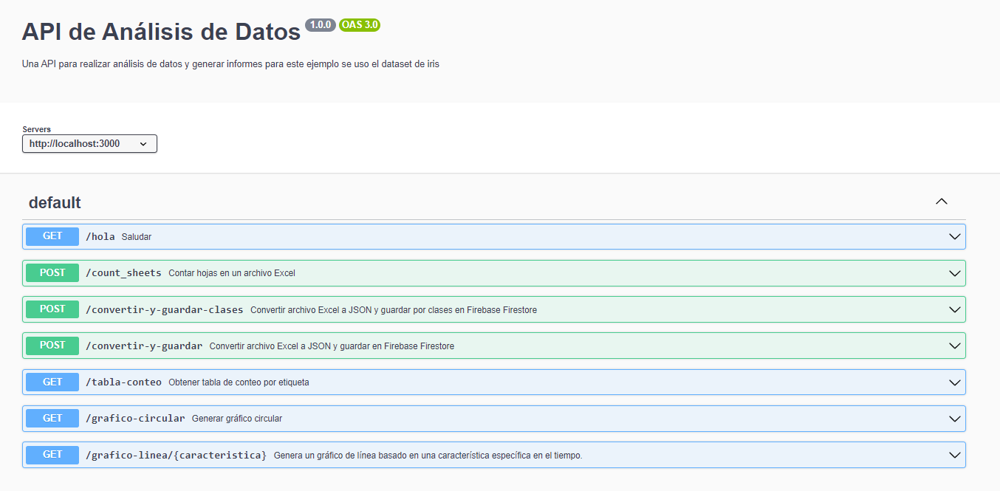
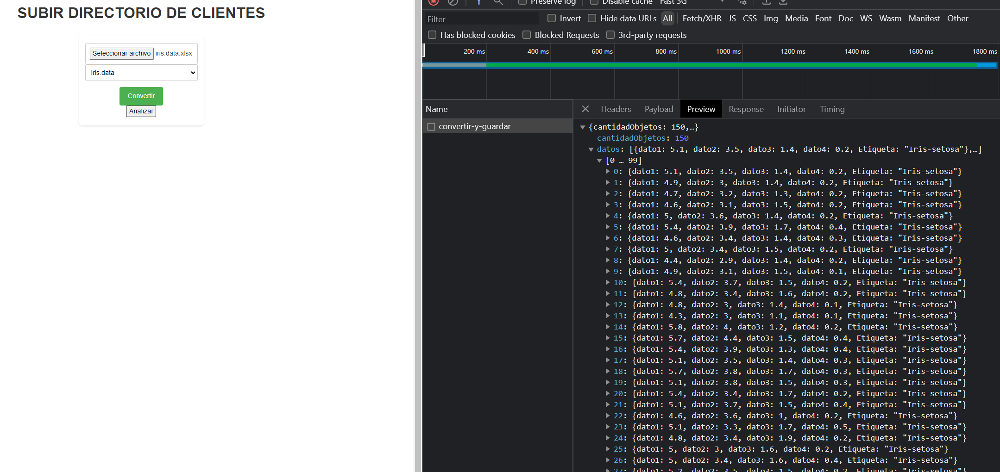
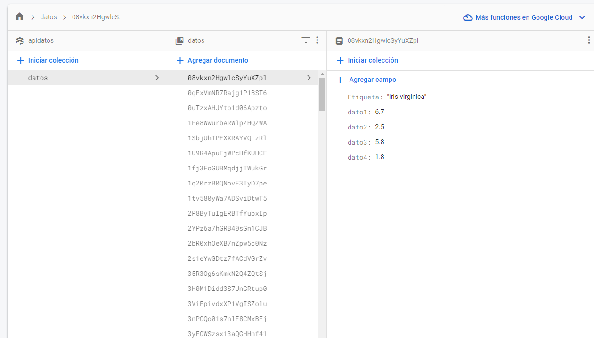
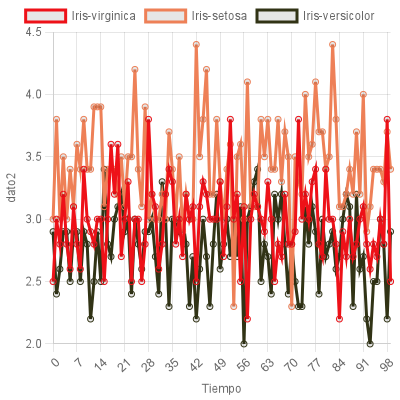
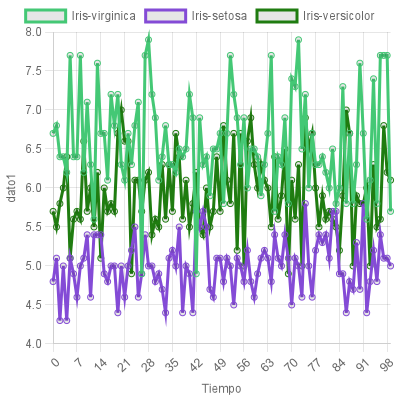

API de Análisis de Datos
Esta es una API que permite realizar análisis de datos a partir de archivos Excel y generar gráficos circulares basados en los datos almacenados en Firebase Firestore.

Tabla de contenidos
Instalación
Configuración
Rutas
Uso
Ejemplos
Instalación
Clona este repositorio en tu máquina local.

git clone https://github.com/tu-usuario/api-analisis-datos.git
Instala las dependencias necesarias.

cd api-analisis-datos
npm install
Configura las credenciales de Firebase Firestore. Coloca el archivo serviceAccountKey.json proporcionado por Firebase en el directorio raíz del proyecto.
Configuración
Antes de ejecutar la API, asegúrate de haber realizado la configuración necesaria:

Crea una nueva base de datos en Firebase Firestore y asegúrate de tener las credenciales correctas en el archivo serviceAccountKey.json.
Rutas
La API cuenta con las siguientes rutas:

POST /convertir-y-guardar: Convierte un archivo Excel (XLSX) a formato JSON y guarda los datos en Firebase Firestore en la colección "datos".
POST /convertir-y-guardar-clases: Convierte un archivo Excel (XLSX) a formato JSON y guarda los datos en Firebase Firestore, agrupándolos por etiquetas en colecciones separadas.
GET /tabla-conteo: Obtiene un conteo de la cantidad de elementos por etiqueta a partir de los datos almacenados en Firebase Firestore.
GET /grafico-circular: Genera un gráfico circular (pie chart) que muestra la distribución de clases en el conjunto de datos almacenados en Firebase Firestore.
Uso
Para convertir un archivo Excel a formato JSON y guardar los datos en Firebase Firestore, utiliza las rutas /convertir-y-guardar o /convertir-y-guardar-clases. Asegúrate de enviar el archivo Excel en la solicitud y especificar el número de hoja a procesar (en caso de ser necesario).

Para obtener un conteo de la cantidad de elementos por etiqueta a partir de los datos almacenados en Firebase Firestore, utiliza la ruta /tabla-conteo.

Para generar un gráfico circular que muestre la distribución de clases en el conjunto de datos almacenados en Firebase Firestore, utiliza la ruta /grafico-circular. El gráfico se devolverá en formato base64.

Ejemplos
A continuación se presentan algunos ejemplos de cómo usar la API:

Convertir y guardar un archivo Excel en formato JSON en Firebase Firestore:
yaml

POST /convertir-y-guardar

Body:
- excel: archivo.xlsx
- sheetNumber: 0
Convertir y guardar un archivo Excel en formato JSON en Firebase Firestore, agrupando los datos por etiquetas:
yaml

POST /convertir-y-guardar-clases

Body:
- excel: archivo.xlsx
- sheetNumber: 1
Obtener un conteo de la cantidad de elementos por etiqueta:

GET /tabla-conteo
realiza un conteo de el numero de clases que tiene nuestra base de datos

GET /grafico-circular
realiza un grafico circular con las etiquetas encontradas en la base de datos

GET /grafico-linea/{caracteristica}
Esta ruta permite generar un gráfico lineal que muestra la evolución de una característica específica a lo largo del tiempo para diferentes etiquetas o clases
caracteristica: en este caso puede ser dato1, dato2, dato3 o dato4 segun nuestra base de datos utilizada

documentacion con Swagger

POST /convertir-y-guardar

base de datos de POST /convertir-y-guardar

GET /grafico-linea/dato1

GET /grafico-linea/dato2

